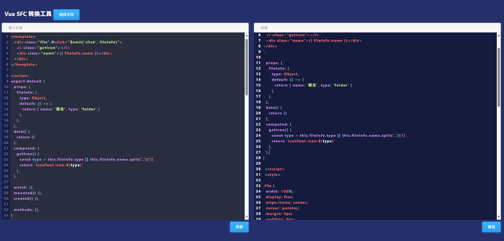
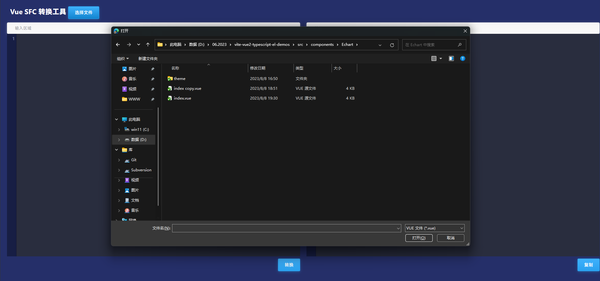
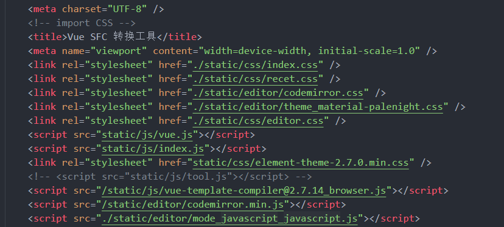

# VueSFC Tool

调用`vue-template-compiler@2.7.14_browser`库VueSFC Tool 可以将.vue文件转换为传统多页面模式，方便在维护老旧项目中快速开发，转换代码。

```js
 ...
const compiler = VueTemplateCompiler;
  if (!compiler) {
    throw new Error("VueTemplateCompiler is not defined");
  }
 const parsed = compiler.parseComponent(text);
...
```




## 输入：

```vue
<template>
  <div class="file" @click="$emit('click', fileInfo)">
    
    <div class="name">{{ fileInfo.name }}</div>
  </div>
</template>

<script>
export default {
  props: {
    fileInfo: {
      type: Object,
      default: () => {
        return { name: '湖北', type: 'folder' }
      },
    },
  },
  data() {
    return {}
  },
  computed: {
    imgSrc() {
      return `./img/${this.fileInfo.type}.png`
    },
  },

  watch: {},
  mounted() {},
  created() {},

  methods: {},
}
</script>

<style scoped>
.file {
  width: 100%;
  display: flex;
  align-items: center;
  cursor: pointer;
  margin: 6px;
  padding: 8px;
}
</style>

```

## 输出

```html <script> 
<script> 
 const MyComponent = 
{ 
 template: `
<div class="file" @click="$emit('click', fileInfo)">
  
  <div class="name">{{ fileInfo.name }}</div>
</div>
`, 
 
  props: {
    fileInfo: {
      type: Object,
      default: () => {
        return { name: '湖北', type: 'folder' }
      },
    },
  },
  data() {
    return {}
  },
  computed: {
    imgSrc() {
      return `./img/${this.fileInfo.type}.png`
    },
  },

  watch: {},
  mounted() {},
  created() {},

  methods: {},
}
 
 </script> 
 <style> 
 
.file {
  width: 100%;
  display: flex;
  align-items: center;
  cursor: pointer;
  margin: 6px;
  padding: 8px;
}
 
</style> 
```

## 特性

### 支持读取本地文件



### 离线模式

所有资源已经下载本地



## 部署

使用es6的模块化，不支持文件协议打开，需要使用webserve打开